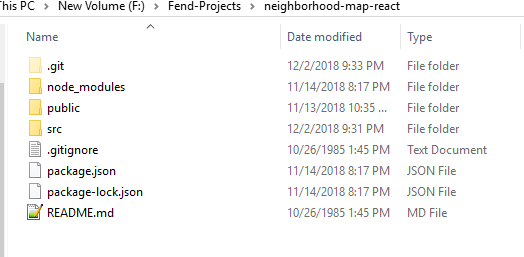
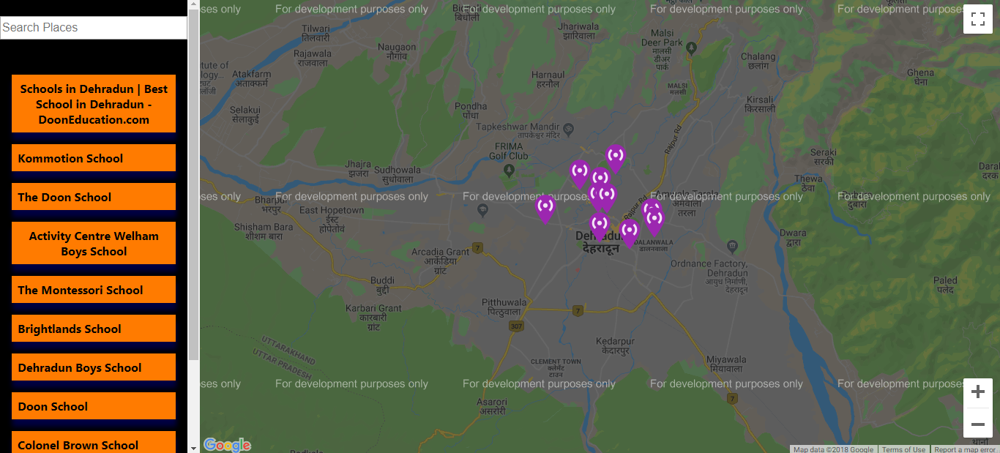

# React NeighborHood Map Project

## About:
Bootstrapped :clapper: with [create-react-app](https://facebook.github.io/create-react-app/),this project is about making a beautiful UI with reactjs while using GoogleMaps :earth_asia: with it. The main purpose of this project is to display locations on Google Map according to a certain criteria.

## How To Run:
To run this project, :arrow_down_small: [Download it here](https://github.com/Prateek-Tewari/neighborhood-map-react/archive/master.zip). (Project dependencies given at bottom).

You will get a zip file. Unzip with some utility like :seven:-zip or winzip.

On opening the unzipped folder,you will get something like this:

With any terminal on your system,navigate to this folder and then type `npm start` and your application will run on port 3000 by default.
This is how the project will look like in the browser.

## Project Dependencies:
- You need to install Node Package Manager aka npm.This comes bundled with Nodejs.[Download Nodejs here](https://nodejs.org/dist/v10.14.1/node-v10.14.1-x64.msi).
- Zip utility for unzipping the downloaded files. I prefer 7-Zip. [Download it here - Windows 32 Bit](https://www.7-zip.org/a/7z1805.exe) and [Windows 64 Bit](https://www.7-zip.org/a/7z1805-x64.exe).For other operating systems , here is the [direct link](https://www.7-zip.org/download.html) for the website.

## Feel free to play :dart: around.
